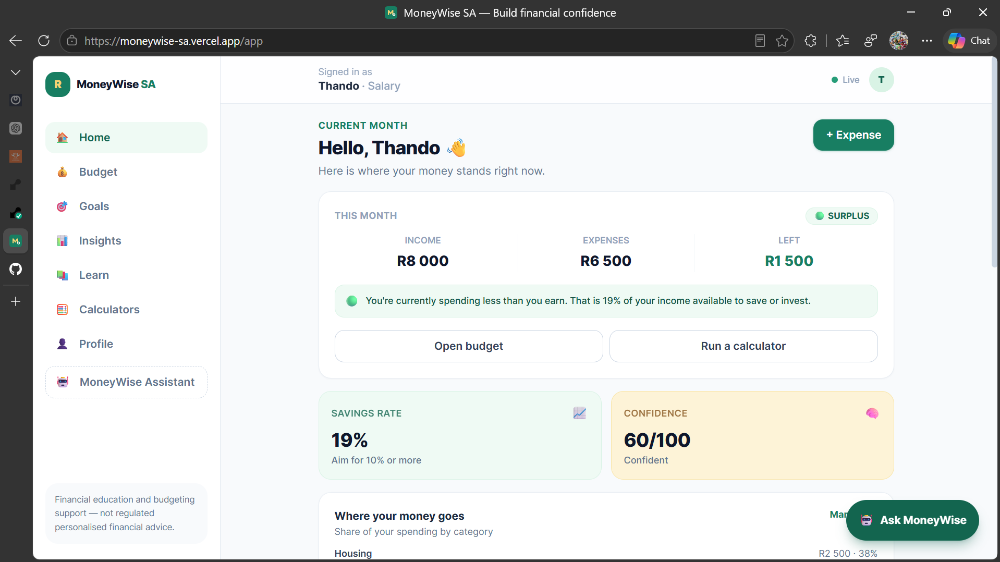

# 💰 MoneyWise SA

### Building financial confidence, one decision at a time.

**A mobile-first financial education and money-management web app for young South Africans — students, first-time earners, gig workers and anyone who has ever asked "why does my money disappear so quickly?"**

> 🇿🇦 Access to banking is not the same as financial confidence. MoneyWise SA closes that gap with simple budgeting tools, real South African money context, a signature **Money Confidence Score**, calculators, lessons and an educational assistant.

[Live demo](https://moneywise-sa.vercel.app) · [API docs](docs/api.md) · [Architecture](docs/architecture.md) · [Roadmap](docs/roadmap.md)

---

## The problem

Imagine your first salary: **R8,000**.

| | |
| --- | --- |
| Rent | R2,500 |
| Transport | R1,200 |
| Groceries | R1,500 |
| Data | R400 |
| Family support | R500 |
| Entertainment | R400 |
| **Total expenses** | **R6,500** |
| **Remaining** | **R1,500** |

You have access to money and financial products, but you still ask:

- *"Can I afford this?"*
- *"How much should I save?"*
- *"How do I start an emergency fund?"*
- *"What's the difference between saving and investing?"*

Existing apps **report** transactions and balances. MoneyWise SA builds **understanding and confidence**.

## The solution

| | Feature | What it does |
| --- | --- | --- |
| 💰 | **Financial dashboard** | Income, expenses, what is left — plus a plain-language verdict |
| 📊 | **Budget planner** | Per-category limits with overspend flags (`Entertainment budget exceeded by R50`) |
| 🧠 | **Money Confidence Score** | 0–100 across budgeting, saving, debt, emergency fund and knowledge — measures habits, never wealth |
| 📚 | **Learning hub** | 7 short SA-focused lessons + a 6-question knowledge check |
| 🧮 | **Calculators** | Savings, emergency fund, debt repayment, 50/30/20 split |
| 🎯 | **Savings goals** | Target, progress, monthly contribution, months to go |
| 🤖 | **MoneyWise assistant** | Ask *"Can I afford a R1,500 phone contract?"* and get an educational breakdown of your ratios |
| 🔥 | **Challenges & badges** | 7-day no-spend, R100 saving, subscription audit, and five earned badges |

### Why it stands out

- **South African by design** — taxi fares, data bundles, prepaid electricity, stokvels, funeral cover, NSFAS allowances, social grants and family support are first-class categories, not afterthoughts.
- **The Money Confidence Score** — a signature feature that scores *behaviour*, not bank balance, and names your strongest area and next opportunity.
- **Offline-first** — every calculation runs locally in the browser; a Flask REST API adds persistence and shared logic when connected.
- **Education, not advice** — the app explains and equips, and never gives regulated personalised financial advice.

---

## 🛠 Technology

| Layer | Stack |
| --- | --- |
| Frontend | React 19, Vite, React Router 7, Tailwind CSS 4 |
| State | Context API + `localStorage` (offline-first) |
| Backend | Python 3.11, Flask, blueprint routes |
| Database | SQLite now → Firebase/Firestore in Phase 5 |
| API | REST (`/api/*`), JSON, CORS-enabled |
| Testing | pytest (26 cases), ESLint |
| Deployment | Vercel (frontend) · Render (API) · GitHub |

## 🏗 Architecture

```
                    MONEYWISE SA
                         │
                         ▼
                 ┌───────────────┐
                 │ React Frontend│   mobile-first, bottom navigation
                 └───────┬───────┘
                         │
          ┌──────────────┼──────────────┐
          ▼              ▼              ▼
      Dashboard      Budgeting      Learning Hub
          │              │              │
          └──────────────┼──────────────┘
                         ▼
               utils/ (pure logic)          services/api.js
          calculations · confidence                  │
                assistant                     ┌──────┴───────┐
                                              ▼              ▼
                                       REST API          local engine
                                       Flask /api       (offline fallback)
                                              │
                                     ┌────────┴────────┐
                                     ▼                 ▼
                              SQLite storage     calculation services
                            (Firestore next)     (same algorithms)
```

Full detail: [`docs/architecture.md`](docs/architecture.md)

---

## 📸 Screenshots

| Landing | Dashboard (live) | Confidence score |
| --- | --- | --- |
| _coming soon_ | [](https://moneywise-sa.vercel.app/app) | _coming soon_ |

> Live production dashboard: R8,000 income · R6,500 expenses · R1,500 left · Confidence 60/100 · API connected (**Live** badge). Add more device screenshots to `/screenshots` here before publishing the portfolio version.

---

## 🚀 Getting started

### Prerequisites

- Node.js 20+
- Python 3.11+

### 1. Frontend

```bash
cd frontend
npm install
npm run dev          # http://localhost:5173
```

### 2. Backend (optional — the app works without it)

```bash
cd backend
python -m venv .venv
.venv\Scripts\activate          # macOS/Linux: source .venv/bin/activate
pip install -r requirements.txt
python run.py                   # http://localhost:5000
```

With both running, the top bar shows **Live** (API connected). Without the API it
shows **Local** and everything still works.

### 3. Verify

```bash
cd frontend && npm run lint && npm run build
cd backend  && python -m pytest
```

---

## ☁️ Deployment

| Piece | Host | Status |
| --- | --- | --- |
| Frontend | Vercel → [moneywise-sa.vercel.app](https://moneywise-sa.vercel.app) | ✅ live |
| Backend | Render → [moneywise-sa.onrender.com](https://moneywise-sa.onrender.com) | ✅ live |

**How it's wired:** Render serves the API from `render.yaml` (root `backend/`,
`gunicorn run:app`, CORS locked to the Vercel URL, SQLite on `/tmp`). The Vercel
build reads `VITE_API_URL=https://moneywise-sa.onrender.com/api`, so the top bar
shows **Live** — and if Render ever sleeps, every feature still works offline on
the local engine.

---

## 📡 API

`POST /api/assistant/ask`, `POST /api/insights/confidence`,
`POST /api/calculators/{savings,emergency,debt,split}`,
`GET/POST /api/budget`, `GET/POST /api/expenses`,
`GET/POST /api/state`, `GET /api/learning`, `GET /api/health`

Complete request/response examples: [`docs/api.md`](docs/api.md)

---

## 📈 Roadmap

| Phase | Status |
| --- | --- |
| 1 · Ideation & problem definition | ✅ |
| 2 · UX/UI (mobile-first design system) | ✅ |
| 3 · Frontend (React, state, calculations) | ✅ |
| 4 · Backend (Flask REST API) | ✅ |
| 5 · Database (SQLite → Firestore) | ✅ interim |
| 6 · Auth, charts, AI coach, notifications | ⏳ |
| 7 · Frontend tests & security hardening | 🟡 |
| 8 · Deploy to Vercel + Render | ✅ |
| 9 · GitHub, demo video, portfolio | 🟡 repo + live demo + dashboard screenshot ✅, video pending |

Full plan: [`docs/roadmap.md`](docs/roadmap.md)

## 💼 Future improvements

- Firebase Authentication with per-user Firestore sync
- Interactive charts for cash flow and goal trajectories
- LLM-powered assistant behind the existing `/api/assistant/ask` contract
- Budget alerts and streak notifications
- Monthly "money report" export for portfolio reviews
- Premium tier: advanced analytics, goal planning, AI coach
- B2B: financial wellness for employers, universities and NGOs

## 🌍 Social impact

MoneyWise SA is a **digital financial-confidence platform** — not just another
expense tracker. It helps South Africans understand their finances, develop
healthier money habits and make more informed decisions.

The goal is measurable behaviour change: a funded emergency fund, a budget that
holds, debt cleared faster, and a generation that can answer *"can I afford this?"*
with numbers instead of a guess.

**Business model (post-MVP):** freemium core (budgeting, calculators, education) +
premium analytics and AI coaching, plus B2B licensing to employers, universities
and NGOs running financial literacy programmes.

## ⚖️ Disclaimer

MoneyWise SA provides **financial education and budgeting support only**. Nothing
in this application is regulated personalised financial, investment, credit or tax
advice.

## 📄 License

MIT — see [`LICENSE`](LICENSE)

## 🧑🏽‍💻 Author

Built as an FNB App Academy–style capstone project.
Contributions, feedback and issue reports are welcome.
